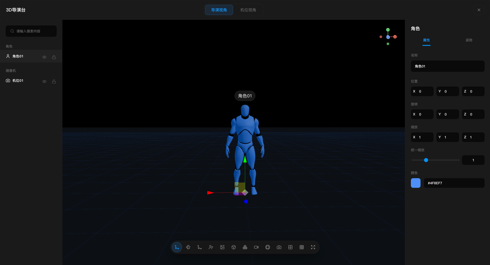
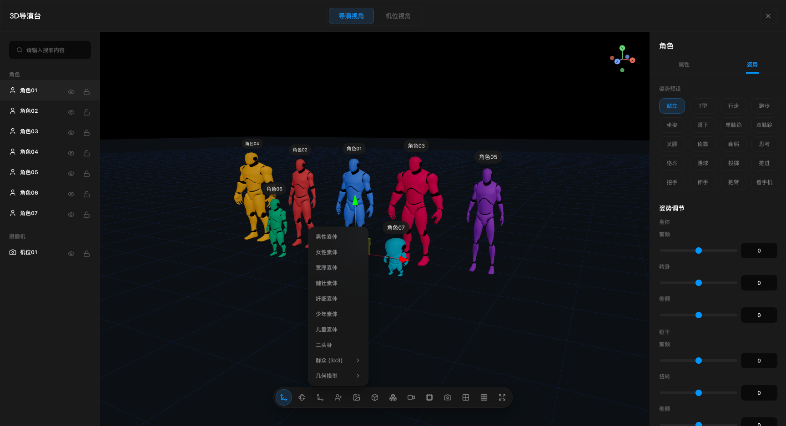
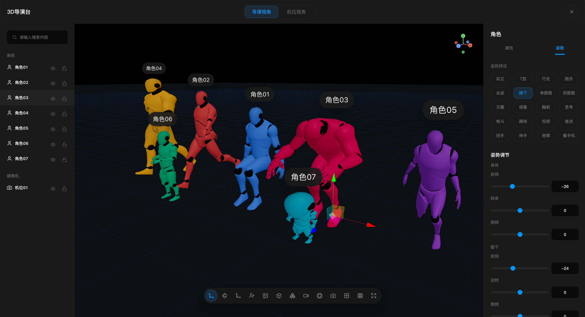
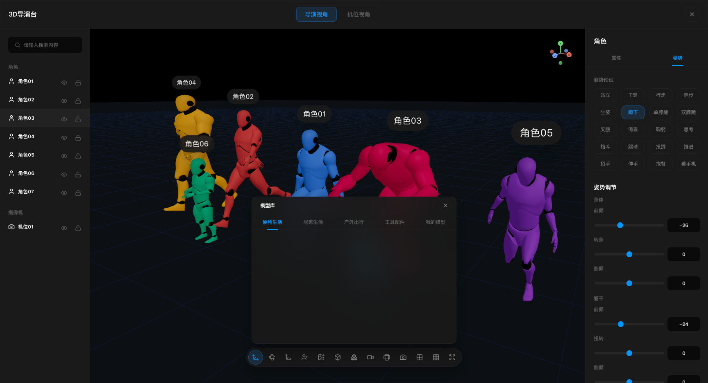
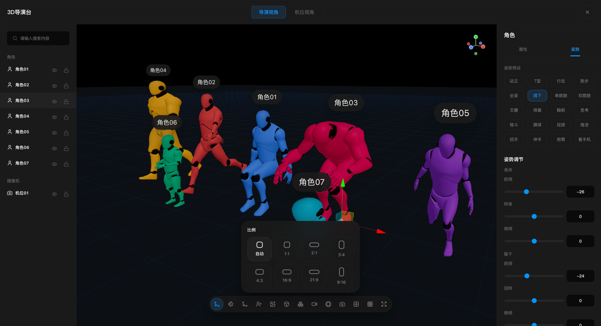
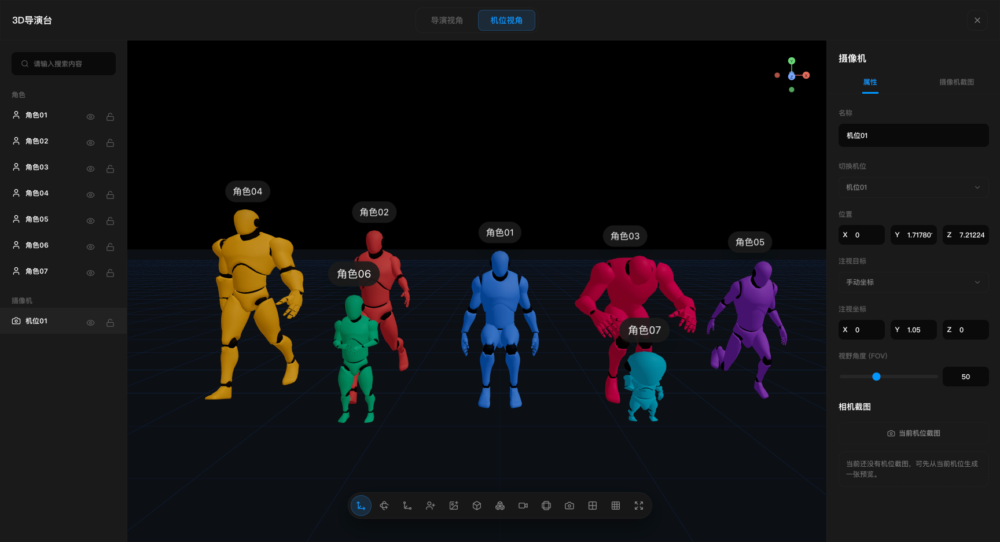
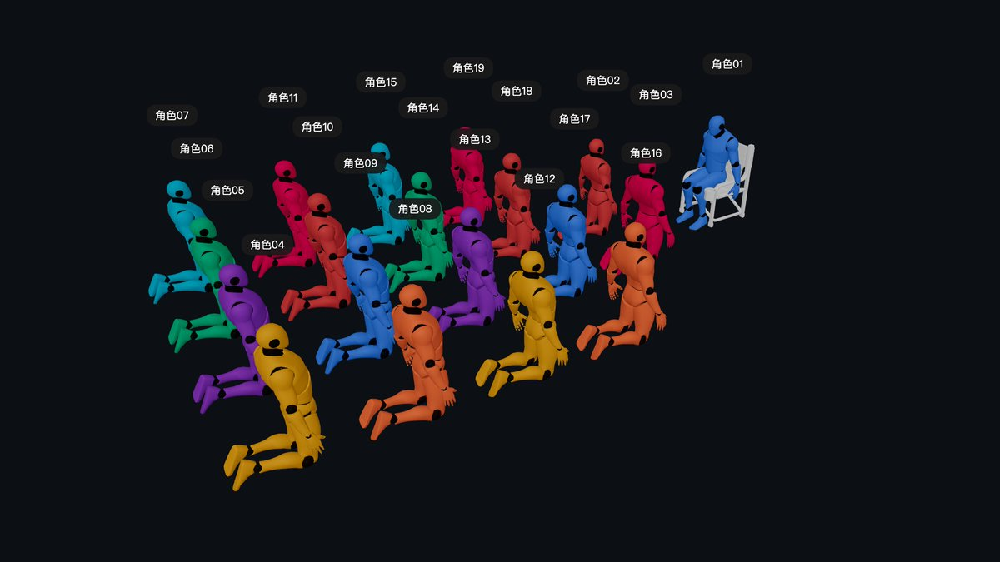

# 3D导演台

一个基于 React、Vite、Three.js 和 React Three Fiber 的 3D 分镜导演台。它适用于轻量级预演、镜头规划和场景摆位，支持在浏览器里搭建角色、机位、场景和全景背景，并快速记录镜头与截图结果。

## 功能概览

- 导演视角 / 机位视角切换
- 内置8种不同的人物，20种不同的人物姿势
- 角色、群演、基础几何体和机位快速添加
- 本地 FBX / OBJ 模型导入，可自定义模型库
- 群众阵列，想多少人就可以多少人
- 全景图导入与背景调节
- 机位拍摄、截图记录和基础镜头管理
- 视口比例框、九宫格、平移 / 旋转 / 缩放控制
- 本地场景状态持久化

## 界面截图









## 技术栈

- React 18
- Vite 6
- TypeScript
- Three.js
- @react-three/fiber
- @react-three/drei
- Zustand
- Vitest

## 项目结构

```text
src
├─ index.ts            # npm 组件入口
├─ DirectorDesk.tsx    # 可嵌入的 React 组件
├─ app/layout          # 顶层壳布局，组织画布与左右侧栏
├─ editor/canvas       # Three.js / R3F 视口、画幅框、工具条、截图视图
├─ editor/panels       # 左侧对象树与右侧属性面板
├─ editor/store        # Zustand 状态管理、撤销与剪贴板逻辑
├─ editor/io           # 截图导出、工程导入导出、宿主通信
├─ editor/loaders      # 本地模型与全景图导入
├─ editor/runtime      # 角色渲染、骨骼和姿势应用
├─ editor/schema       # 数据结构、机位和视口相关定义
└─ styles              # 全局样式

docs                   # 组件调用示例（消费 dist 打包产物）
dist                   # Vite lib 构建产物（发布用）
```

## 作为组件使用

Peer dependencies：仅需 `react`、`react-dom`。`three`、`@react-three/fiber`、`@react-three/drei` 等由本包装配为 dependencies，随安装自动带上。

```bash
npm install monto-3d-director-desk
```

```tsx
import { DirectorDesk, createDefaultDirectorProject } from "monto-3d-director-desk";
import "monto-3d-director-desk/style.css";

export function MyPage() {
  return (
    <div style={{ height: "100vh" }}>
      <DirectorDesk
        theme="dark"
        instanceId="my-project"
        initial={createDefaultDirectorProject()}
        material={{
          kind: "panorama",
          url: "https://example.com/panorama.jpg",
        }}
        showCloseButton={false}
        onReady={() => console.log("ready")}
        onChange={(project) => console.log("project changed", project)}
        onCapturesSent={(captures) => console.log(captures)}
      />
    </div>
  );
}
```

- `initial`：外部工程快照（`DirectorProject`），每个 `instanceId` 首次就绪时灌入一次（支持异步后到）。
- `onChange`：工程内容变化时触发（默认防抖 300ms），便于宿主持久化。
- `ref`：暴露截图 imperative API（见下）。

### 截图 API

所有截图输出的 `dataUrl` 均为 **PNG base64 Data URL**，格式：

```text
data:image/png;base64,<payload>
```

类型别名：`DirectorDeskImageDataUrl` / `ScreenshotDataUrl`（可直接用于 `` 或持久化字符串）。

底部工具栏「当前视角截图」调用链：

`ViewportToolbar.handleCapture("current")` → `requestViewportCapture()` → `DirectorCanvas.CanvasCaptureBridge` 内注册的 WebGL 截图 handler（最终走 `captureViewportCanvas()`）。

外部可通过 `ref` 调用同等能力：

```tsx
import { useRef } from "react";
import { DirectorDesk, type DirectorDeskHandle } from "monto-3d-director-desk";

const deskRef = useRef<DirectorDeskHandle>(null);

<DirectorDesk ref={deskRef} onReady={() => console.log("ready")} />;

// 纯视口截图（等同 CapturePanel）
await deskRef.current?.captureCurrentView();

// 四 / 十二方位
await deskRef.current?.captureFourDirections();
await deskRef.current?.captureTwelveDirections();

// 当前机位截图（等同 CameraPanel）
await deskRef.current?.captureCameraShot("cam_1", { saveToProject: true });

// 等同底部工具栏相机按钮：必要时新建机位、切机位视角、写入工程
await deskRef.current?.captureFromToolbar("current");

// 发送到宿主（触发 onCapturesSent / postMessage）
deskRef.current?.sendCaptures([{ dataUrl: "...", fileName: "shot.png" }]);
```

也可直接 import 低层函数（需组件已挂载且 Canvas 已注册 handler）：

`captureCurrentView` / `captureFourDirections` / `captureTwelveDirections` / `captureCameraShot` / `captureFromViewportToolbar` / `requestViewportCapture`

传入 `material.kind === "panorama"` 且 `url` 非空时，会自动加载该全景图，并禁用工具栏「导入全景图」。

## 本地开发与构建

本仓库的 `src` 是 **Vite lib** 组件库，不提供根目录独立 `dev` 应用；需先打包，再由宿主或 `docs/` 引用 `dist`。

```bash
pnpm install
pnpm build
```

产物在 `dist/`（`monto-3d-director-desk.js`、`style.css`、类型声明）。

本地 playground（会先执行 `pnpm build`）：

```bash
pnpm dev:docs
```

默认地址通常为 `http://127.0.0.1:5273/`。修改库源码后需重新 `pnpm build`（或重启 `pnpm dev:docs`）才能在 docs 中看到更新。

## 常用操作

- 顶部可切换 `导演视角` 与 `机位视角`
- 左侧用于搜索、选择、分组查看场景对象，并支持可见性 / 锁定 / 删除
- 中央视口用于摆放场景、切换变换模式、添加角色和机位、导入资源与截图
- 右侧属性面板会根据当前选中对象自动切换为场景 / 角色 / 模型 / 摄像机编辑面板

## 快捷键

- `Ctrl/Cmd + C`：复制当前选中对象
- `Ctrl/Cmd + V`：粘贴复制对象
- `Ctrl/Cmd + Z`：撤销最近一次操作
- `Delete / Backspace`：删除当前选中对象

## 数据与嵌入

- 当前场景与本地模型库会写入浏览器 `localStorage`
- 支持导出工程 JSON，也支持通过文件重新导入
- 支持“保存最近工程 / 恢复最近工程”
- 组件已包含宿主页面通信桥，适合嵌入到更大的创作工作台中

## 构建与测试

构建库产物：

```bash
pnpm build
```

构建 docs playground：

```bash
pnpm build:docs
```

测试：

```bash
pnpm test
```

## GitHub Pages

推送到 `main` 后，`.github/workflows/deploy-docs.yml` 会自动构建 `docs` 并部署到 GitHub Pages。

首次启用时，在仓库 **Settings → Pages** 将 Source 设为 **GitHub Actions**。部署地址一般为：

`https://<owner>.github.io/monto-3d-director-desk/`


## 开源说明

- 本仓库以可发布的 React 组件库为主，适合嵌入更大的创作工作台。
- 当前版本保留内置角色能力，并支持通过界面导入本地模型与全景图。
- 若你基于本项目继续发布，请自行确认新增模型、贴图和场景素材的分发许可。

## License

MIT
